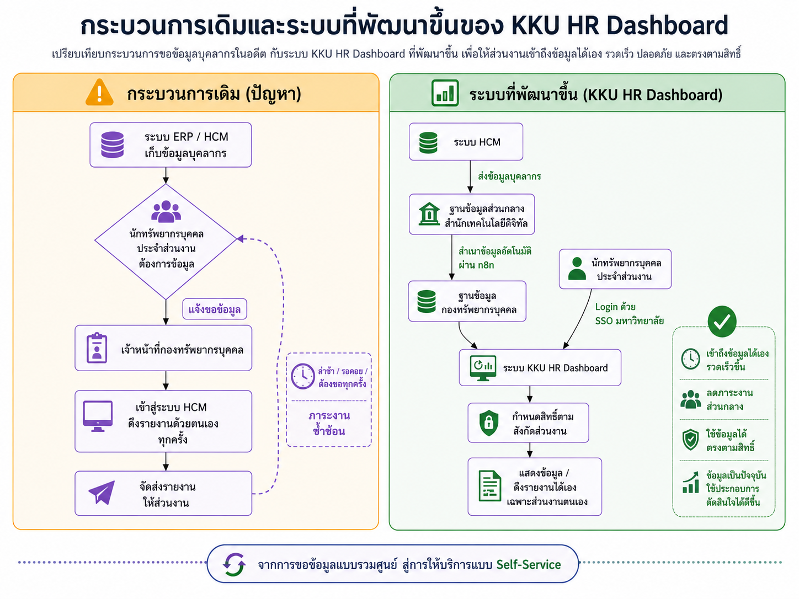

# KKU HR Dashboard

ระบบแดชบอร์ดวิเคราะห์ข้อมูลบุคลากร มหาวิทยาลัยขอนแก่น (KKU HR Dashboard)
แสดงภาพรวมข้อมูลบุคลากรในรูปแบบกราฟและตารางสรุป พร้อมรองรับการส่งออกข้อมูลเป็น Excel และ PDF

> โปรเจกต์นี้เป็นส่วนหนึ่งของโครงการ **KKU AI Hackathon 2026**
> จัดระหว่างวันที่ **29 สิงหาคม – 1 กันยายน พ.ศ. 2569**

## ทีมผู้จัดทำ

ทีม **Chat GBP**

| ชื่อ-สกุล | ตำแหน่ง |
| --- | --- |
| นายพงศ์พันธ์ คำสิงห์ | นักวิชาการโสตทัศนศึกษา |
| นางสาวคณิศร แป้นจัตุรัส | นักทรัพยากรบุคคล |
| นายคณินท์ อุชชิน | นักวิชาการคอมพิวเตอร์ |

ทั้งหมดสังกัด **กองทรัพยากรบุคคล สำนักงานอธิการบดี มหาวิทยาลัยขอนแก่น**

## บริบทและที่มาของปัญหา

จากการรวมศูนย์สู่คอขวดของข้อมูล เมื่อมหาวิทยาลัยขอนแก่นก้าวสู่การใช้ระบบ ERP/HCM เต็มรูปแบบ
ข้อมูลที่เคยกระจัดกระจายตามหน่วยงานได้ถูกยกระดับให้รวมศูนย์ (Centralized) ทว่าระบบในปัจจุบันกลับสร้าง
"คอขวดใหม่" เนื่องจากสิทธิ์การดึงข้อมูลและรายงานถูกจำกัดไว้ที่กองทรัพยากรบุคคลส่วนกลางเพียงแห่งเดียว

### จุดวิกฤตที่ฉุดรั้งประสิทธิภาพองค์กร

| | ประเด็น | รายละเอียด |
| --- | --- | --- |
| ⏳ | **Time Bottleneck** (ความล่าช้า) | หน่วยงานย่อยขาดความคล่องตัว สูญเสียเวลาไปกับการรอคอยข้อมูลจากส่วนกลาง |
| 🔄 | **Operational Overhead** (ภาระงานซ้ำซ้อน) | เจ้าหน้าที่ส่วนกลางต้องจมอยู่กับการดึงรายงานรูปแบบเดิมซ้ำซาก จนขาดเวลาโฟกัสงานเชิงกลยุทธ์ |
| 📉 | **Human Error Risks** (ความเสี่ยงข้อมูล) | ข้อจำกัดด้านเวลาบีบบังคับให้ต้องสรุปตัวเลขแบบ Manual นำไปสู่ความผิดพลาดที่ส่งผลต่อการตัดสินใจ |
| 🚫 | **Rigid Data Structure** (ขาดความยืดหยุ่น) | รายงานมาตรฐานจากส่วนกลาง ไม่ตอบโจทย์ความต้องการเชิงลึก (Insight) ที่แตกต่างกันของแต่ละหน่วยงาน |

### เป้าหมายเชิงกลยุทธ์

| | เป้าหมาย | รายละเอียด |
| --- | --- | --- |
| 🚀 | **Maximize Productivity** (ยกระดับประสิทธิภาพ) | ขจัดเวลารอคอย (Zero Wait-Time) คืนเวลาให้บุคลากรไปโฟกัสกับงานที่มีมูลค่าสูงขึ้น |
| ⚡ | **Data Democratization** (กระจายอำนาจข้อมูล) | ติดอาวุธให้หน่วยงานย่อยด้วยระบบ Self-Service เพื่อให้เข้าถึงและจัดการข้อมูลได้อิสระตามสิทธิ์ |
| 🛡️ | **Trust & Accuracy** (สร้างความเชื่อมั่น) | ลดข้อผิดพลาดจากงาน Manual เพื่อให้ได้ Data ที่แม่นยำและนำไปใช้ต่อได้อย่างมั่นใจ |
| 🌐 | **True Digital Transformation** (ขับเคลื่อนสู่ดิจิทัล) | เปลี่ยนผ่านองค์กรด้วยเทคโนโลยีที่ใช้งานได้จริง ไม่ใช่แค่การเปลี่ยนซอฟต์แวร์ |

### บทสรุปและทิศทางการพัฒนา

ปัญหาการเข้าถึงระบบ HCM ในปัจจุบัน ไม่ใช่แค่ความไม่สะดวก แต่คือ "ต้นทุนแฝง" ที่ชะลอการเดินหน้าขององค์กร
หากไม่เร่งแก้ไขจะยิ่งสร้างภาระงานซ้ำซ้อนและกระทบต่อกรอบเวลาสำคัญ ดังนั้น การพัฒนาระบบ
"Self-Service Data Retrieval" ที่คืนอำนาจให้หน่วยงานย่อยสามารถดึงข้อมูลได้เอง จึงไม่ใช่แค่ทางเลือก
แต่เป็น "หัวใจหลัก" ในการปลดล็อกศักยภาพการทำงานของมหาวิทยาลัยขอนแก่นให้ก้าวหน้าอย่างไร้รอยต่อ



## ความสามารถของระบบ

- **เข้าสู่ระบบด้วย KKU SSO** — อนุญาตเฉพาะอีเมลที่ลงทะเบียนในระบบเท่านั้น (whitelist)
- **Dashboard ภาพรวมบุคลากร** — การ์ดสรุปจำนวนบุคลากร (ทั้งหมด/ชาย/หญิง) และกราฟ:
  - ช่วงอายุ (Generation)
  - ประเภทบุคลากร
  - สายงาน
  - ช่วงเงินเดือน
  - บุคลากรแยกตามคณะ/หน่วยงาน (เฉพาะผู้ดูแลระบบ/ผู้บริหาร)
- **ตัวกรองข้อมูล** — ประเภทบุคลากร, สายงาน, คณะ/หน่วยงาน, ฝ่าย, เพศ และช่วงเงินเดือน พร้อมตัวแสดงสถานะกำลังโหลด
- **ส่งออกข้อมูล (Export)** — เลือกคอลัมน์ที่ต้องการก่อนส่งออกเป็นไฟล์ Excel (`.xlsx`) หรือ PDF (`.pdf`)
  - ชื่อไฟล์รูปแบบ `personnel_export_yyyy-mm-dd_hh_mm_ss.xlsx` / `.pdf`
  - ไฟล์ PDF รองรับภาษาไทย (ฝังฟอนต์ Noto Sans Thai)
- **การจัดการผู้ใช้ (Admin)** — เพิ่ม/แก้ไข/ลบผู้ใช้, กำหนดบทบาทและคณะ/หน่วยงาน
- **บันทึกการใช้งาน (Audit Log)** — เก็บประวัติการเข้าสู่ระบบ, การส่งออกข้อมูล และการจัดการผู้ใช้ พร้อมค้นหาและแบ่งหน้า

## บทบาท (RBAC)

| บทบาท | สิทธิ์ |
| --- | --- |
| `STAFF` | ดูข้อมูลวิเคราะห์เฉพาะคณะ/หน่วยงานของตน, ส่งออกข้อมูล |
| `EXECUTIVE` | ดูภาพรวมทั้งมหาวิทยาลัยเท่านั้น (ไม่สามารถส่งออกข้อมูล) |
| `ADMIN` | ดูข้อมูลทั้งหมด, จัดการผู้ใช้, ดูบันทึกการใช้งาน, ส่งออกข้อมูล |

- อีเมลผู้ดูแลระบบสูงสุด (`SUPER_ADMIN_EMAIL`) ไม่สามารถแก้ไขหรือลบผ่าน UI/API ได้
- ตาราง `User` เป็นแหล่งข้อมูลหลักในการควบคุมสิทธิ์ บทบาทจะถูกอ่านใหม่จากฐานข้อมูลทุกครั้งที่มีการอ่าน session

## โครงสร้างทางเทคนิค

- **Frontend**: Next.js 16 (App Router, Turbopack) + React 19 + TypeScript (strict)
- **UI**: Tailwind CSS v4 + Lucide React + Recharts
- **ฐานข้อมูลภายใน**: PostgreSQL + Prisma (ตาราง `User`, `AuditLog`)
- **แหล่งข้อมูลบุคลากร**: MySQL (ตาราง `KKU_HCM_TO_BI_CURRENT`) — อ่านอย่างเดียว
- **การยืนยันตัวตน**: NextAuth v5 (Auth.js) + KKU SSO (OAuth2)
- **ส่งออก**: `xlsx` (Excel), `jsPDF` (PDF)

## เริ่มต้นใช้งาน

### 1. ติดตั้ง dependencies

```bash
npm install
```

### 2. ตั้งค่าตัวแปรสภาพแวดล้อม

คัดลอก `.env.example` เป็น `.env` แล้วกรอกค่าที่ถูกต้อง:

```bash
cp .env.example .env
```

ตัวแปรที่สำคัญ:

| ตัวแปร | คำอธิบาย |
| --- | --- |
| `DATABASE_URL` | URL เชื่อมต่อ PostgreSQL (ฐานข้อมูลภายในของระบบ) |
| `MYSQL_HOST` / `MYSQL_PORT` / `MYSQL_USER` / `MYSQL_PASSWORD` / `MYSQL_DATABASE` | ข้อมูลเชื่อมต่อ MySQL (แหล่งข้อมูลบุคลากร) |
| `AUTH_SECRET` | Secret สำหรับเข้ารหัส session (ความยาวอย่างน้อย 32 ตัวอักษร) |
| `AUTH_URL` | URL ต้นทางของแอป (รองรับ `https://localhost:3000`) |
| `KKU_CLIENT_ID` / `KKU_CLIENT_SECRET` / `KKU_APP_ID` | ข้อมูลแอป KKU SSO |
| `KKU_REDIRECT_URL` | URL กลับหลังยืนยันตัวตน (`/auth/callback`) |
| `KKU_TOKEN_URL` | URL แลก token ของ KKU SSO |
| `SUPER_ADMIN_EMAIL` | อีเมลผู้ดูแลระบบสูงสุด (กันการลบ/แก้ไข) |

### 3. เริ่มฐานข้อมูล PostgreSQL

```bash
docker compose up -d
```

### 4. สร้างตารางฐานข้อมูล (Prisma migrate)

```bash
npx prisma migrate dev
# หรือถ้ายังไม่มี migration
npx prisma db push
```

### 5. เริ่มเซิร์ฟเวอร์สำหรับพัฒนา

```bash
npm run dev
```

> สคริปต์ `dev` ใช้ `next dev --experimental-https` — แอปจะทำงานผ่าน HTTPS ที่ `https://localhost:3000`

### การ build สำหรับ production

```bash
npm run build
npm start
```

## โครงสร้างโฟลเดอร์หลัก

```
src/
├── app/
│   ├── auth/                 # หน้าเข้าสู่ระบบ KKU SSO, callback, logout
│   ├── dashboard/            # หน้าแดชบอร์ดและปุ่มส่งออก
│   ├── admin/
│   │   ├── users/            # จัดการผู้ใช้
│   │   └── logs/             # บันทึกการใช้งาน
│   └── api/
│       ├── auth/[...nextauth]/
│       ├── admin/users/      # API จัดการผู้ใช้
│       └── export/           # API ส่งออก Excel/PDF
├── components/
│   ├── dashboard/            # การ์ด, กราฟ, แถบตัวกรอง, แถบส่งออก
│   └── ui/                   # คอมโพเนนต์ UI ที่ใช้ร่วม (Pagination)
├── lib/
│   ├── auth.ts               # การตั้งค่า NextAuth + KKU SSO + RBAC
│   ├── db/mysql.ts           # เชื่อมต่อ MySQL (แหล่งข้อมูลบุคลากร)
│   ├── services/analytics.service.ts  # ตรรกะการคำนวณและกรองข้อมูล
│   ├── export-columns.ts     # นิยามคอลัมน์สำหรับส่งออก
│   └── pdf-font.ts           # ฝังฟอนต์ไทยสำหรับ PDF
├── proxy.ts                  # กำหนดการเข้าถึงเส้นทาง (Middleware)
└── ...
```

## เส้นทางหลัก

| เส้นทาง | คำอธิบาย |
| --- | --- |
| `/` | หน้าแรก |
| `/auth/signin` | หน้าเข้าสู่ระบบ KKU SSO |
| `/auth/callback` | รับ callback จาก KKU SSO |
| `/auth/logout` | ออกจากระบบ |
| `/dashboard` | หน้าแดชบอร์ด (ต้องเข้าสู่ระบบ) |
| `/admin/users` | จัดการผู้ใช้ (เฉพาะ ADMIN) |
| `/admin/logs` | บันทึกการใช้งาน (เฉพาะ ADMIN) |
